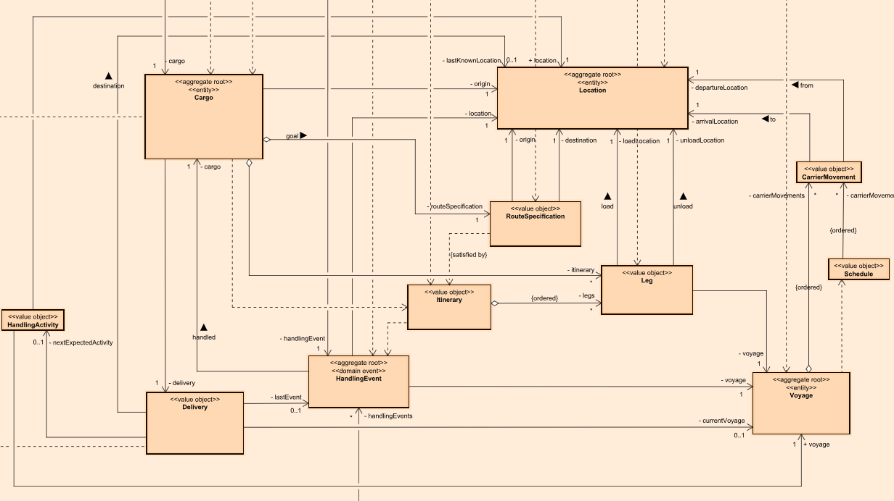
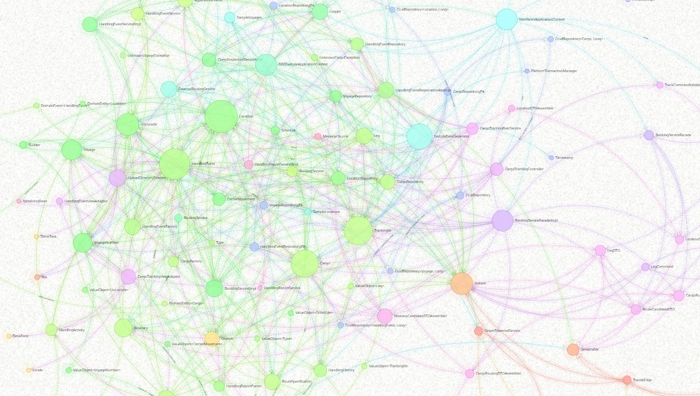

# UML Diagram for the DDD Example in Evans' Book

This project uses UML diagrams to illustrate the structure and behavior of the DDD example—a cargo shipping system—from Eric Evans' book (*Domain-Driven Design: Tackling Complexity in the Heart of Software*). These diagrams are created based on the source code of the [dddsample-core](https://github.com/citerus/dddsample-core) project on GitHub. The aim of these diagrams is to help us understand how the example implements the strategic and tactical designs of DDD and the mechanisms by which it operates.  

If you want to get into DDD theory, check out Evans' book. If you want to get into the implementation details, check out the source code. Also, if you want to understand the UML model behind these diagrams, open the model file (ddd-example-in-evans-book.asta) using the modeling tool [Astah Professional/UML/Viewer](https://astah.net/download).  

Clicking on the UML diagram image below opens it in Diagram Map [[1]](#footnote1).

<a id="footnote1">[1]</a> Diagram Map allows you to zoom and pan, like Google Maps, when viewing a UML diagram. You can view it with any browser. If you want to create one yourself, [Astah Professional/UML](https://astah.net/download) and the [m+ plug-in](https://sites.google.com/view/m-plus-plugin/download) are required.

## User-system interaction
This sequence diagram illustrates the key interactions between the user and the system, with references to other diagrams.

## Domain model overview
This class diagram illustrates the basic elements of the domain model and their relationships. The layout of the elements in the domain model is based on the diagram presented in the dddsample-core project. Attributes and operations are hidden to focus on understanding the elements and their relationships. If you want to see them, open the model file using the modeling tool Astah.

## Domain objects for "ABC123" cargo
This object diagram shows the basic domain objects and thier connections. In particular, it shows the object snapshot associated with the cargo object "ABC123," which is preset as sample data. The cargo "ABC123," which is en route from HongKong to Helsinki, is currently at the Port of New York, where unloading has been completed.

## Overall structure
This class diagram illustrates the overall structure of the cargo shipping system: it is composed of two contexts, the Booking context and the Transport network context. The system is implemented using Spring projects such as Spring Boot / MVC / Data JPA. Note that this diagram focuses on elements and relationships that may be considered and does not reflect the entire implementation. Attributes and operations are also hidden to focus on understanding the elements and their relationships. If you want to see them, open the model file using the modeling tool Astah.

## Behavior 1: Initialization
This communication diagram illustrates a scenario in which the user launches the cargo shipping system, with a focus on messages that may be worth considering.

## Behavior 2: Cargo tracking
This communication diagram shows a scenario in which the user requests tracking for cargo "ABC123" on the cargo tracking page. The cargo "ABC123," which is preset by the system and en route from HongKong to Helsinki, is currently at the port of New York, where unloading has been completed.

## Behavior 3-1: Cargo booking
This communication diagram shows a scenario in which the user registers new cargo on the cargo booking page.

## Behavior 3-2: Route suggestion
This communication diagram illustrates a scenario in which the user requests cargo routing on the cargo booking result page, followed by the presentation of route candidates.

## Behavior 3-3: Route assignment
This communication diagram illustrates a scenario in which the user requests to assign new cargo to a delivery route on the route selection page.

## Extra: Directed graph
This is a directed graph that represents the structural elements and their relationships, associated with the Booking context and the Transport network context. This graph allows you to view the relationships between elements in various layouts.

References
---
* Evans, Eric. Domain-Driven Design: Tackling Complexity in the Heart of Software, Addison-Wesley, 2004.
* Evans, Eric. Domain-Driven design Reference: Definitions and pattern summaries. Dog Ear Publishing, 2014.

Links
---
* [citerus/dddsample-core](https://github.com/citerus/dddsample-core) @GitHub
* [Astah Professional/UML/Viewer](https://astah.net/download) download page
* [m+ plug-in](https://sites.google.com/view/m-plus-plugin/download) download page

License
---
Diagram map (diagram_map.html) and Directed graph (directed_graph.html) include the following libraries:
* [D3.js](https://d3js.org) is copyrighted by Mike Bostock and is released under the [BSD license](https://opensource.org/licenses/BSD-3-Clause).
* [Popper.js](https://popper.js.org) is copyrighted by Federico Zivolo and is released under the [MIT license](https://opensource.org/licenses/MIT).
* [Tippy.js](https://atomiks.github.io/tippyjs) is copyrighted by atomiks and is released under the [MIT license](https://opensource.org/licenses/MIT).
* [Chroma.js](https://gka.github.io/chroma.js) is copyrighted by Gregor Aisch and is released under the [BSD license](https://opensource.org/licenses/BSD-3-Clause).
* [Three.js](https://threejs.org) is copyrighted by three.js authors and is released under the [MIT license](https://opensource.org/licenses/MIT).
* [Vanta.js](https://www.vantajs.com) is copyrighted by Teng Bao and is released under the [MIT license](https://opensource.org/licenses/MIT).

Files and data in this project other than the above libraries are under the [Creative Commons Zero (CC0) license](https://creativecommons.org/publicdomain/zero/1.0/).
