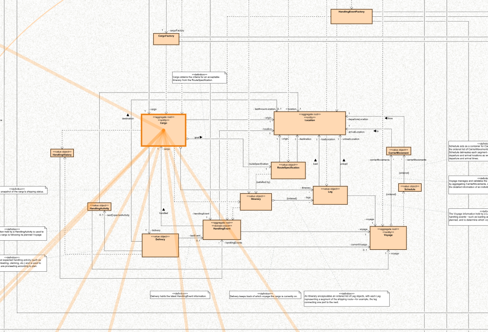
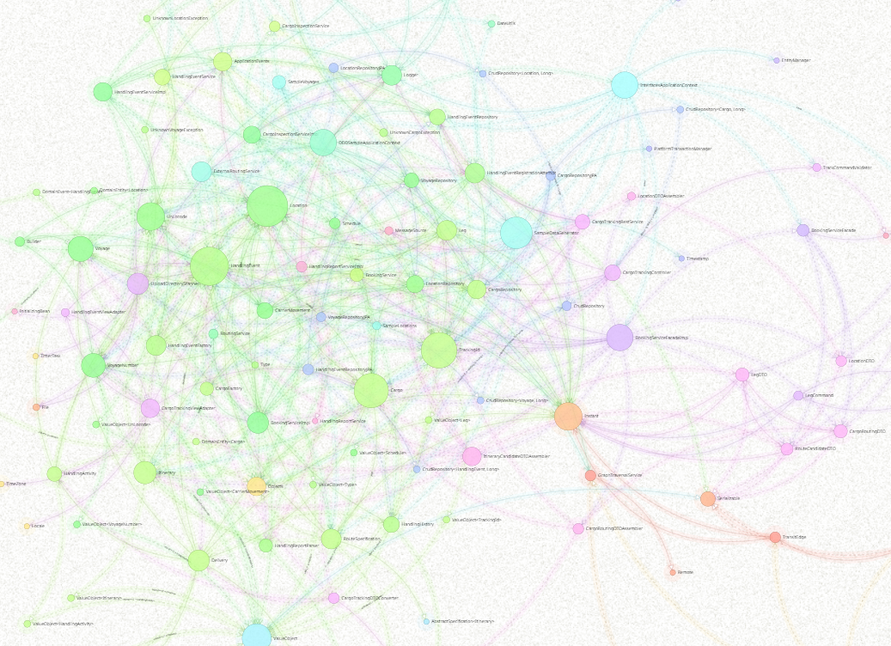

# UML Diagram for the DDD Example in Evans' Book

This project uses UML diagrams to illustrate the structure and behavior of the DDD example—a cargo shipping system—from Eric Evans' book. These diagrams are created based on the source code of the [dddsample-core](https://github.com/citerus/dddsample-core) project on GitHub. The aim of these diagrams is to help us understand how the example implements the strategic and tactical designs of DDD and the mechanisms by which it operates.  

If you want to get into DDD theory, check out Evans' book. If you want to get into the implementation details, check out the [source code](https://github.com/citerus/dddsample-core). Also, if you want to understand the UML models behind these diagrams, open the model file (ddd-example-in-evans-book.asta) in this project using the modeling tool [Astah Professional/UML/Viewer](https://astah.net/download).  

Click the diagram you want to see.

## User-system interaction
This sequence diagram illustrates the key interactions between the user and the system, with references to other diagrams.

## Domain model overview
This class diagram illustrates the basic elements of the domain model and their relationships. The layout of the elements is based on the diagram presented in the [dddsample-core](https://github.com/citerus/dddsample-core) project.

## Domain objects for ABC123 cargo
This object diagram shows the connections among the basic domain objects. Specifically, it shows the object snapshot associated with the cargo object "ABC123," which is preset as sample data. The cargo "ABC123," which is en route from HongKong to Helsinki, is currently at the Port of New York, where unloading has been completed.

## Overall structure
This class diagram illustrates the overall structure of the cargo shipping system: it is composed of two contexts, the Booking context and the Transport network context. The system is implemented using Spring projects such as Spring Boot / MVC / Data JPA.

Notes:
* This diagram focuses on key elements and relationships and does not reflect the entire implementation.
* Attributes and operations are hidden to focus on understanding the elements and their relationships. If you want to see them, open the model file in the modeling tool Astah.

## [Behavior 1] Initialization
This communication diagram illustrates a scenario in which the user initiates the cargo shipping system, with a focus on important messages.

## [Behavior 2] Cargo tracking
This communication diagram shows a scenario in which the user requests tracking for cargo "ABC123" on the cargo tracking page, with a focus on important messages. The cargo "ABC123," which is preset by the system and en route from HongKong to Helsinki, is currently at the Port of New York, where unloading has been completed.

## [Behavior 3-1] Cargo booking
This communication diagram shows a scenario in which the user registers new cargo on the cargo booking page, with a focus on important messages.

## [Behavior 3-2] Route suggestion
This communication diagram illustrates a scenario in which the user requests cargo routing on the cargo booking result page, followed by the presentation of route candidates. The diagram focuses on important messages.

## [Behavior 3-3] Route assignment
This communication diagram illustrates a scenario in which the user requests to assign new cargo to a delivery route on the route selection page, with a focus on important messages.

## Extra 1: Diagrams in a single map
This is a Diagram map [[1]](#footnote1) that shows the above diagrams in a single map. This map allows related elements to be highlighted across diagrams.

<a id="footnote1">[1]</a> For more info, see [this post](https://dev.to/takaakit/diagram-map-tracing-uml-sysml-elements-across-diagrams-49i7).

## Extra 2: Directed graph
This is a directed graph that represents the elements and their relationships, associated with the Booking context and the Transport network context. This graph allows the relationships between elements to be viewed in various layouts.

References
---
* Evans, Eric. Domain-Driven Design: Tackling Complexity in the Heart of Software, Addison-Wesley, 2004.
* Evans, Eric. Domain-Driven design Reference: Definitions and pattern summaries. Dog Ear Publishing, 2014.

Links
---
* [citerus/dddsample-core](https://github.com/citerus/dddsample-core)
* [Diagram Map: tracing UML elements across diagrams](https://dev.to/takaakit/diagram-map-tracing-uml-sysml-elements-across-diagrams-49i7)
* [Astah Professional/UML/Viewer](https://astah.net/download)

License
---
Diagram map (diagram_map.html) and Directed graph (directed_graph.html) include the following libraries:
* [D3.js](https://d3js.org) is copyrighted by Mike Bostock and is released under the [BSD license](https://opensource.org/licenses/BSD-3-Clause).
* [Popper.js](https://popper.js.org) is copyrighted by Federico Zivolo and is released under the [MIT license](https://opensource.org/licenses/MIT).
* [Tippy.js](https://atomiks.github.io/tippyjs) is copyrighted by atomiks and is released under the [MIT license](https://opensource.org/licenses/MIT).
* [Chroma.js](https://gka.github.io/chroma.js) is copyrighted by Gregor Aisch and is released under the [BSD license](https://opensource.org/licenses/BSD-3-Clause).
* [Three.js](https://threejs.org) is copyrighted by three.js authors and is released under the [MIT license](https://opensource.org/licenses/MIT).
* [Vanta.js](https://www.vantajs.com) is copyrighted by Teng Bao and is released under the [MIT license](https://opensource.org/licenses/MIT).

Files and data in this project other than the above libraries are under the [Creative Commons Zero (CC0) license](https://creativecommons.org/publicdomain/zero/1.0/).
